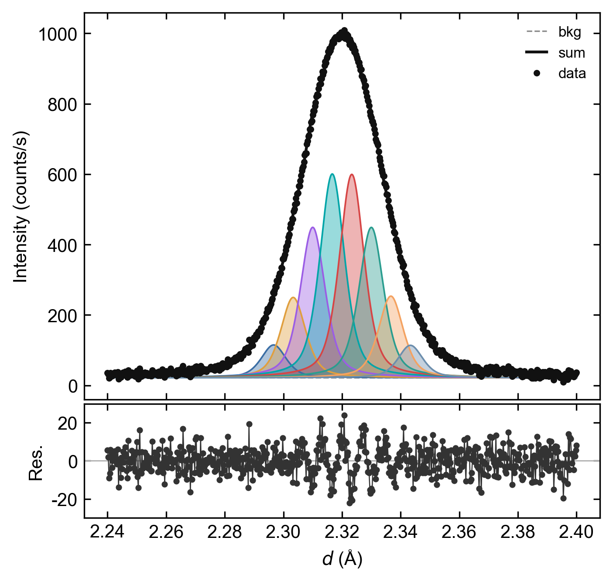
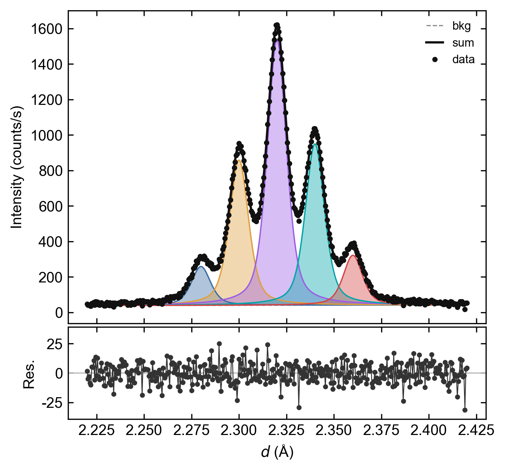
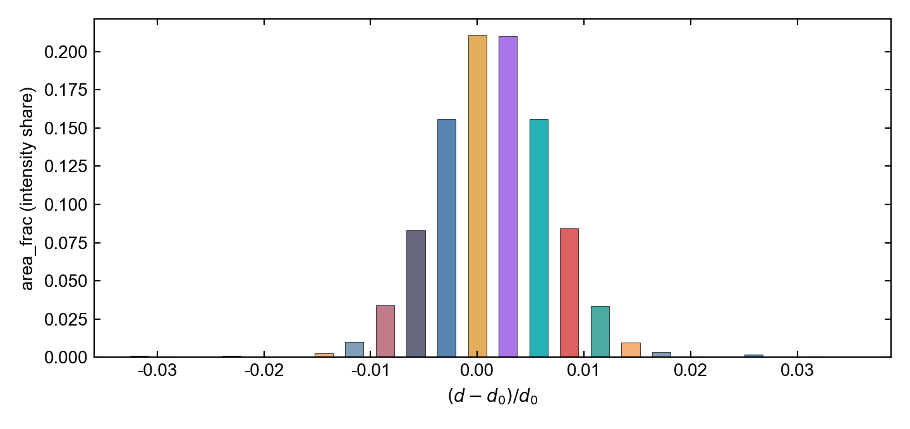

# PeakComb

[](pyproject.toml)
[](LICENSE)
[](peakcomb/gui/app.py)

**把一条宽 XRD / SXRD 峰，拆成一组共享半高宽的 PseudoVoigt 小峰。**

面向两类物理图像：内应力引起的连续 *d* 分布，以及 nanodomain 引起的离散晶格种群。
拟合后端是 [Fityk](https://fityk.nieto.pl/)（`cfityk`）；没有 Fityk 时仍可用非负最小二乘（NNLS）预览并导出。

<p align="center">
  
</p>

This is a standalone package. It does not modify [PeakTrace](https://github.com/D-sudoasd/PeakTrace). Lua contracts, `.peaks` files, `cfityk` discovery, and *d* / *q* / 2θ units stay aligned with PeakTrace.

---

## 这是干什么的

实验室或同步辐射 XRD 里，一条 Bragg 峰常常比仪器宽度更宽、甚至劈裂。原因可能是：

- **Type II 内应变**：晶粒或相内部的弹性应变把 *d* 拉成一条连续分布
- **nanodomain / 化学不均匀**：少数几个离散晶格种群，各自给出一个亚峰

PeakComb 的做法很窄：在选定窗口里，用一组 **共享 FWHM** 的 PseudoVoigt 去铺这个包络。

共享 FWHM 代表「单个 domain 自己的峰宽」（仪器 + 尺寸核）。高度（强度）自由；Distribution 模式下中心锁死在等间距密梳上，Domain 模式下中心可以在小窗口里动。

`area_frac`（表里的 *w*）是该中心处的 **衍射强度份额**。只有结构因子、多重性和织构近似可比时，才能把它当作体积份额的 proxy。本工具不能单独区分 Type II 应变分布和化学/结构 nanodomain。

## 两个模式

| 模式 | 界面名称 | 用途 | 模型 |
|---|---|---|---|
| **Distribution** | 密梳拆分 | 内应力导致的连续 *d* 分布 | 等间距密梳，中心锁死，只拟合非负高度 |
| **Domain** | 少数分立峰 | 少数离散 nanodomain / 劈裂亚峰 | *N* 个等宽峰，高度自由，中心可在小窗口内动 |

<p align="center">
  
  
</p>

Distribution 的密梳可以铺满拟合窗口，也可以取消「密梳范围 = 拟合范围」后单独设密梳区间。默认铺峰是 **对称密梳**（关于窗内峰顶镜像）。

给定参考 *d*<sub>0</sub> 后，每个分量写成晶格应变

```text
ε_i = (d_i − d_0) / d_0
σ_h = E / (1 − 2ν) · ε
ε̄   = Σ w_i ε_i
```

默认 *E* = 80 GPa、*ν* = 0.33。平均应变只有在 *d*<sub>0</sub> 独立给定（不是面积加权平均）时，才是有物理内容的平衡检查。

## 它不是什么

- 不是 Warren–Averbach、不是 Rietveld、不是物相检索
- 不是 PeakTrace：不做连续帧跟踪、方位扫描或机制挖掘
- Domain 的峰个数 *N* 是模型选择；*N* 太大会拟合噪声
- Distribution 网格过密会共线，过疏会在包络上留下锯齿；`qc.json` 报告条件数和空分量比例

## 安装

Python 3.10+。建议用本机的 Miniconda / `py` 启动器。

```powershell
git clone https://github.com/D-sudoasd/PeakComb.git
Set-Location PeakComb
py -m pip install -e ".[dev]"
py -m peakcomb
```

Windows 也可双击仓库里的 `PeakComb_GUI.bat`。

可选依赖：**Fityk / `cfityk.exe`**。查找顺序：

1. 环境变量 `PEAKCOMB_CFITYK`
2. 本仓库 `Fityk\`
3. `E:\Vibe_coding\PeakTrace\Fityk\cfityk.exe`（本机 PeakTrace 安装）
4. `PATH` / Program Files

没有 `cfityk` 时，GUI 预览和 `--nnls-only` 导出仍然可用。

## 图形界面

```powershell
py -m peakcomb
# 或
peakcomb-gui
```

推荐流程：

1. **打开谱…**（`.xy` / `.xye` / `.chi` / `.csv` / `.txt`）
2. 在图上 **拖选** 要拆的峰
3. 选模式：密梳拆分 或 少数分立峰
4. 拖 **N** 和 **FWHM**；预览在后台线程里刷新
5. 需要时在「高级参数」里扣背底、改密梳范围、改 PseudoVoigt shape
6. **导出当前图**，或在装了 Fityk 时跑 **Fityk 拟合**

菜单 **帮助 → 这是什么** 有同一段说明。

支持的横轴：*d* (Å)、*q* (Å⁻¹)、2θ (°)。同步辐射默认能量 83 keV。

扣背底在拟合窗口内进行，方法可选 `asls` / `arpls` / `airpls` / `snip` / `modpoly` / `rubberband`（需要 `pybaselines`；缺库时用 rubberband 兜底）。原始谱保留。

## 命令行

```powershell
py -m peakcomb.cli examples\synthetic_domain.xy `
  --out runs\domain --mode domain --fwhm 0.012 `
  --centers 2.28,2.30,2.32,2.34,2.36 `
  --xmin 2.22 --xmax 2.42 --nnls-only
```

密梳模式（梳子要比 FWHM 更密，包络才平滑；下例 N=24，间距 = 0.4×FWHM）：

```powershell
py -m peakcomb.cli examples\synthetic_distribution.xy `
  --out runs\dist --mode distribution --fwhm 0.010 --n 24 `
  --spacing 0.40 --xmin 2.24 --xmax 2.40 --d0 2.32 --nnls-only
```

常用参数：`--axis d_a|q_inv_a|two_theta_deg`、`--baseline asls`、`--comb-xmin` / `--comb-xmax`、`--background linear`、`--shape 0.35`、`--preview-only`。

示例谱：

| 文件 | 内容 |
|---|---|
| `examples/synthetic_domain.xy` | 五个等宽 PseudoVoigt（Domain） |
| `examples/synthetic_distribution.xy` | 高斯 *d* 分布与固定核卷积（Distribution） |

```powershell
py -m peakcomb.synthesize
```

## 导出

每个 run 目录包含：

| 文件 | 内容 |
|---|---|
| `session.yaml` | 完整拟合会话（可复现） |
| `components.csv` | 每个小峰的 *d*、*w*、*ε*、*σ*<sub>h</sub>、FWHM |
| `curves.csv` | 观测、背景、拟合和各分量曲线 |
| `distribution.csv` | 强度份额对 *d* / *ε* |
| `qc.json` | *R*<sub>wp</sub>、条件数、空分量、解释边界 |
| `figures/` | overlay / residual / distribution / strain（PNG、SVG、PDF） |
| `origin/peakcomb.xlsx` | Origin 友好工作簿 |
| `fit.lua` / `fit.peaks` / `fit.log` | Fityk 跑通时才有 |

## 测试

```powershell
py -m pytest
```

覆盖共享 FWHM 的 Fityk 定义、Lua `$hwhm` 契约、NNLS 对合成 Domain/Distribution 的回收、窗口背底、以及 *ε* / *σ*<sub>h</sub> 换算。

## English summary

PeakComb decomposes one broad XRD/SXRD envelope into a **shared-FWHM** PseudoVoigt comb.

- **Distribution** — locked, equally spaced comb for a continuous *d* distribution (Type II internal strain).
- **Domain** — a few movable equal-width subpeaks for discrete nanodomain populations.

Live preview is NNLS; the official fitter is `cfityk`. `area_frac` is an intensity share, not an automatic volume fraction. The shared width is the single-domain kernel (instrument + size). This is not Rietveld, Warren–Averbach, or PeakTrace frame tracking.

## License

MIT. See [LICENSE](LICENSE).
